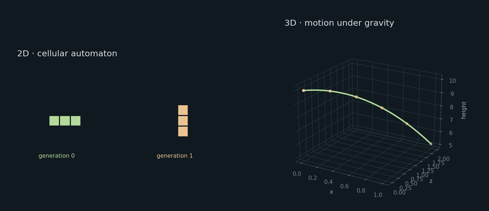

# simulates

A C++23 simulation library.



```sh
cmake -S . -B build
cmake --build build
./build/simulates_examples
```

Examples: [Game of Life](examples/life.cpp), [particles](examples/particles.cpp), [a small economy](examples/civilisation.cpp).
